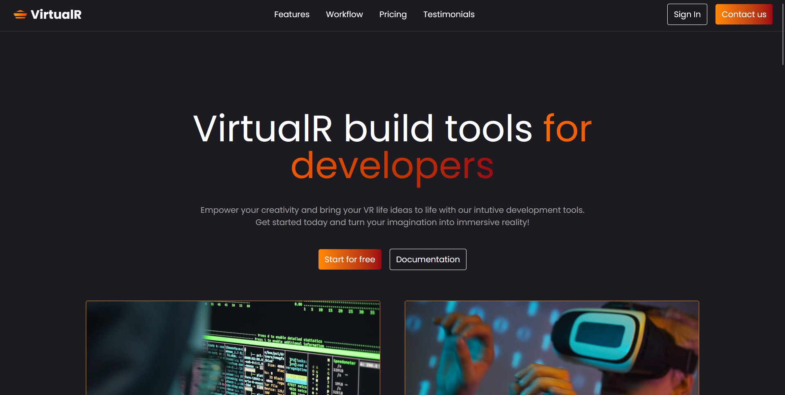

# VirtualR – Landing Page

A modern, responsive landing page for **VirtualR**, built using **React** and **Tailwind CSS**. The project focuses on clean UI, smooth layouts, and reusable components, making it ideal for startups, SaaS products, or portfolio showcases.

---

## 📌 Project Description

**VirtualR** is a visually appealing landing page that represents a virtual reality–based product or platform. The page highlights key features, benefits, pricing, and a call-to-action, all designed with a minimal and professional look. The project is fully responsive and optimized for different screen sizes.

This project is suitable for:
- Practicing modern React component structure
- Learning Tailwind CSS utility-first styling
- Showcasing frontend skills in a portfolio
- Startup or product landing page templates

---

## 🚀 Features

- ⚛️ Built with **React** (component-based architecture)
- 🎨 Styled using **Tailwind CSS**
- 📱 Fully responsive (mobile, tablet, desktop)
- 🧩 Reusable and clean components
- ⚡ Fast and lightweight UI
- 🖼️ Modern hero section, feature cards, pricing, and footer

---

## 🛠️ Tech Stack

- **React**
- **Tailwind CSS**
- **JavaScript (ES6+)**
- **Vite / Create React App** (depending on setup)

---

## 📂 Folder Structure (Example)

```
virtualr-landing-page/
│
├── src/
│   ├── components/
│   │   ├── Navbar.jsx
│   │   ├── Hero.jsx
│   │   ├── Features.jsx
│   │   ├── Pricing.jsx
|   |   ├── Testimonials.jsx
|   |   ├── Workflow.jsx
│   │   └── Footer.jsx
|   |
|   ├── assets/
|   |   ├── close-large-line.svg.svg
|   |   ├── code.jpg
|   |   ├── logo.png
|   |   ├── menu-line.svg
|   |   ├── video1.mp4
│   │   ├── video2.mp4
|   |   └── profile-pictures/
│   │       ├── user1.jpg
│   │       ├── user2.jpg
│   │       ├── user3.jpg
│   │       ├── user4.jpg
│   │       ├── user5.jpg
│   │       └── user6.jpg
|   |
|   ├── constants/
|   |   └── index.jsx
|   |
│   ├── App.jsx
│   ├── main.jsx
│   └── index.css
│
├── public/
├── package.json
└── README.md
```

---

## ⚙️ Installation & Setup

1. Clone the repository
   ```bash
   git clone https://github.com/Huzaif-Ibrahim/VirtualR.git
   ```

2. Navigate to the project folder
   ```bash
   cd VirtualR
   ```

3. Install dependencies
   ```bash
   npm install
   ```

4. Start the development server
   ```bash
   npm run dev
   ```

5. Open in browser
   ```
   http://localhost:5173
   ```

---

## 🎯 Learning Outcomes

- Better understanding of React component design
- Practical experience with Tailwind CSS
- Improved responsive design skills
- Real-world landing page structure

---

## 🤝 Live Preview

   [🔗View website](virtual-r-two-alpha.vercel.app/)

---

## 📸 Screenshots




---

## 🤝 Contributing

Contributions are welcome! Feel free to fork the repository and submit a pull request.

---

## 📄 License

This project is open-source and available under the **MIT License**.

---

## 👤 Author

**Huzaif Ibrahim**  
Full-stack Developer | Backend Enthusiast

---

⭐ If you like this project, don’t forget to star the repository!

